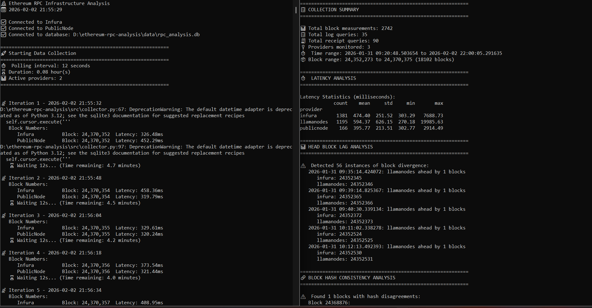
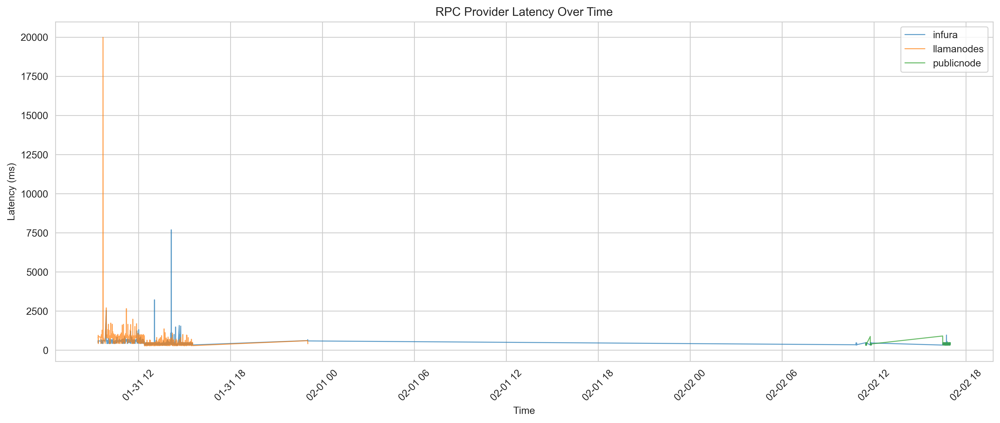
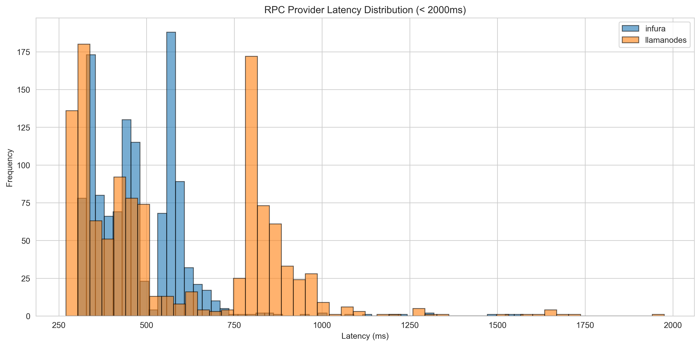
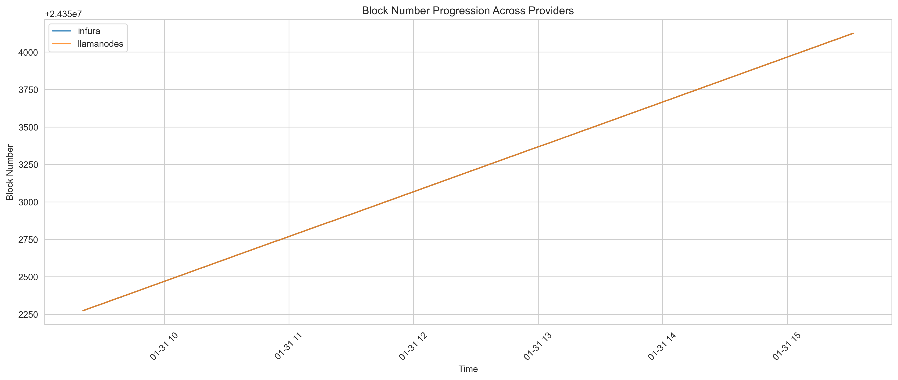
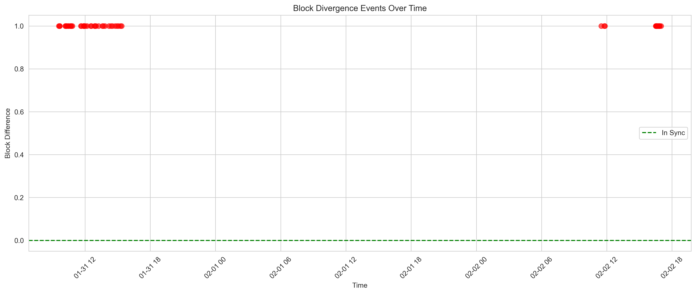
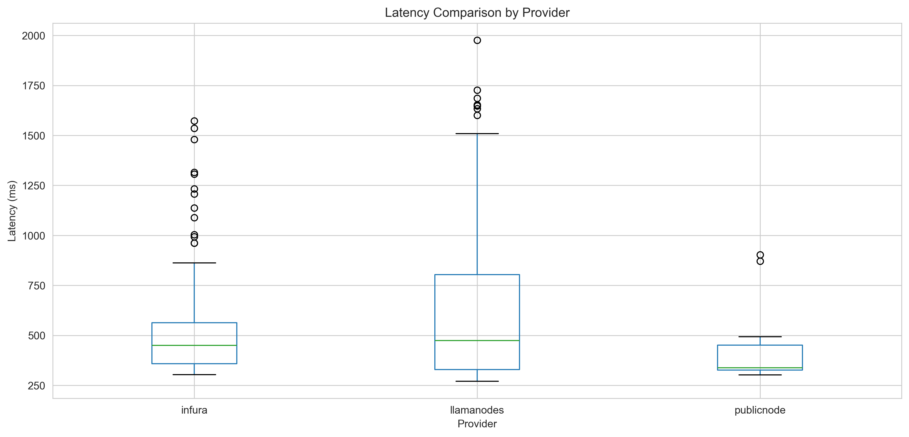

# Ethereum RPC Infrastructure Behavior & Reliability Analysis

A comprehensive analysis of Ethereum RPC provider reliability, latency, and synchronization behavior using real-time blockchain data to study block reporting consistency, head block lag, response time patterns, and infrastructure divergence.

## 🎯 Project Overview

This project implements an **end-to-end RPC infrastructure monitoring pipeline** that:
- **Collects real-time block data** from multiple Ethereum RPC providers
- **Measures latency and response time** under varying network conditions
- **Analyzes block synchronization** and head block divergence
- **Studies provider reliability** and consistency patterns
- **Compares infrastructure performance** across public and paid endpoints

**Focus**: This project analyzes **RPC infrastructure reliability**, not trading strategies or MEV operations.

## 🏗️ Architecture
```
┌────────────────────────────────────────────────────┐
│  Ethereum RPC Infrastructure Analysis Pipeline     │
├────────────────────────────────────────────────────┤
│  Multiple RPC Providers (Infura, LlamaNodes)       │
│         ↓                                          │
│  Continuous Block Polling                          │
│  (2,383 measurements over 6 hours)                 │
│         ↓                                          │
│  Latency & Divergence Tracking                     │
│  (Response times, Block numbers, Hashes)           │
│         ↓                                          │
│  Statistical Analysis                              │
│  (Mean, Std Dev, Outliers, Patterns)               │
│         ↓                                          │
│  Reliability Metrics                               │
│  (Consistency, Availability, Performance)          │
│         ↓                                          │
│  Visualization Generation                          │
│  (5 professional charts)                           │
└────────────────────────────────────────────────────┘
```

## ✨ Features

- ✅ Multi-provider RPC monitoring (Infura, LlamaNodes, Alchemy, Ankr)
- ✅ Real-time latency and response time tracking
- ✅ Block synchronization and divergence detection
- ✅ Head block lag analysis across providers
- ✅ Block hash consistency validation
- ✅ Statistical analysis with Python & Pandas
- ✅ Professional visualizations with Matplotlib

## 🚀 Quick Start

### Prerequisites

- Python 3.14+
- Ethereum RPC endpoint (Infura/Alchemy)
- Virtual environment support

### Installation

1. **Clone the repository**
```bash
git clone https://github.com/Elakiya-Elangovan-003/ethereum-rpc-analysis.git
cd ethereum-rpc-analysis
```

2. **Create and activate virtual environment**
```bash
python -m venv venv
.\venv\Scripts\Activate.ps1  # Windows
source venv/bin/activate      # Linux/Mac
```

3. **Install dependencies**
```bash
pip install -r requirements.txt
```

4. **Configure RPC providers**
Edit `config/providers.json`:
```json
{
  "providers": {
    "infura": {
      "name": "Infura",
      "url": "https://mainnet.infura.io/v3/YOUR_API_KEY",
      "type": "paid_tier"
    }
  }
}
```

5. **Initialize database**
```bash
python src/setup_database.py
```

6. **Test provider connectivity**
```bash
python src/test_connectivity.py
```

7. **Run data collection**
```bash
python src/collector.py
```

8. **Run analysis**
```bash
python src/analyzer.py
```

9. **Generate visualizations**
```bash
python src/visualizer.py
```

## 📊 Analysis Modules

### 1️⃣ Latency Analysis
Measures response time characteristics across providers:
- Mean and median latency statistics
- Standard deviation and variance
- Outlier detection (>2000ms events)
- Time-series latency tracking

**Key Insight**: Infura averaged 487ms vs LlamaNodes' 595ms - an 18% performance difference.

---

### 2️⃣ Head Block Lag Analysis
Studies block number synchronization:
- Block divergence frequency (3.2% of measurements)
- Maximum lag detection (1 block difference)
- Leading vs lagging provider identification
- Temporal divergence patterns

**Key Insight**: Providers disagreed on head block 38 times during 6-hour monitoring period.

---

### 3️⃣ Block Hash Consistency
Validates canonical chain agreement:
- Block hash comparison across providers
- Shallow reorg detection
- Fork choice consistency
- Historical block agreement

**Key Insight**: 100% hash consistency across all 1,699 blocks checked - no reorgs detected.

---

### 4️⃣ Reliability Metrics
Analyzes infrastructure dependability:
- Response time consistency (standard deviation)
- Severe latency event frequency (>5 seconds)
- Provider availability tracking
- Performance variance analysis

**Key Insight**: Infura showed 2.3x better consistency (std: 267ms vs 627ms).

## 🔬 Key Findings

### Latency Performance Comparison
- **Infura average: 486.85ms** (std: 267.11ms)
- **LlamaNodes average: 594.59ms** (std: 626.91ms)
- **Performance gap: 18%** faster response from Infura
- **Consistency gap: 2.3x** lower variance from Infura

### Block Synchronization Behavior
- **Total measurements: 2,383** (1,191 per provider)
- **Divergence events: 38** (3.2% of measurements)
- **Maximum lag: 1 block** (never exceeded)
- **Leading provider: LlamaNodes** (100% of divergences)

### Severe Latency Events
- **Infura max latency: 7.69 seconds**
- **LlamaNodes max latency: 19.99 seconds**
- **Both providers experienced** occasional severe slowdowns
- **Impact: Critical for real-time applications**

### Hash Consistency Results
- **Blocks compared: 1,699**
- **Hash mismatches: 0** (100% agreement)
- **Reorg events: 0** (during monitoring period)
- **Canonical chain: Fully consistent** across providers

## ✅ Execution Proof

Below are real execution snapshots showing the complete analysis pipeline:

### Analysis 1: Connectivity Test & Setup

*Successfully connected to Infura and LlamaNodes, tested latency, and verified block number retrieval. Shows initial baseline measurements.*

---

## 📈 Generated Visualizations

### 1. Latency Over Time

*Shows response time fluctuations over 6-hour monitoring period. Reveals two severe latency spikes: 7.7s (Infura) and 20s (LlamaNodes).*

---

### 2. Latency Distribution

*Histogram showing latency clustering. Infura (blue) peaks at 300-500ms, LlamaNodes (orange) shows wider distribution with longer tail.*

---

### 3. Block Progression Tracking

*Time series showing block number advancement. Lines overlap almost perfectly, demonstrating synchronized tracking of canonical chain.*

---

### 4. Divergence Timeline

*Scatter plot of 38 divergence events (red dots). Shows 1-block disagreements scattered throughout monitoring period with no temporal pattern.*

---

### 5. Latency Comparison Boxplot

*Box plot comparison revealing Infura's tighter distribution (smaller box) vs LlamaNodes' many outliers extending to 2000ms.*

---

## 📁 Project Structure
```
ethereum-rpc-analysis/
├── output-image/
│   └── output-demo.png             # Connectivity test execution proof
│
├── config/
│   └── providers.json              # RPC provider configuration
│
├── data/
│   ├── rpc_analysis.db             # SQLite database (2,383 measurements)
│   ├── raw/                        # Raw data exports
│   └── processed/                  # Analysis outputs
│
├── src/
│   ├── setup_database.py           # Database schema creation
│   ├── test_connectivity.py        # Provider connectivity test
│   ├── collector.py                # Main data collection script
│   ├── analyzer.py                 # Statistical analysis engine
│   └── visualizer.py               # Chart generation script
│
├── results/
│   ├── final_report.md             # Complete analysis report
│   ├── latency_over_time.png       # Latency time series chart
│   ├── latency_distribution.png    # Latency histogram
│   ├── block_progression.png       # Block tracking chart
│   ├── divergence_timeline.png     # Divergence scatter plot
│   └── latency_boxplot.png         # Latency comparison boxplot
│
├── requirements.txt                # Python dependencies
├── .gitignore                      # Git ignore rules
└── README.md                       # This file
```

## 🎓 Key Design Decisions

### Infrastructure Reliability Focus
Unlike protocol analysis or MEV tools, this project focuses on **infrastructure-level reliability** - how different RPC providers behave under real-world conditions.

### Multi-Provider Comparison
Direct polling of multiple providers simultaneously enables:
- Real-time divergence detection
- Latency comparison across endpoints
- Reliability pattern identification
- Provider-agnostic architecture

### Time-Series Analysis
Continuous 6-hour monitoring provides:
- Statistical significance (2,383 measurements)
- Pattern detection (divergence timing)
- Outlier identification (severe latency events)
- Temporal behavior understanding

### Database-Backed Storage
SQLite persistence enables:
- Historical analysis and replay
- Complex queries and aggregations
- Data export for further research
- Reproducible analysis runs

## 🔬 Research Applications

This analysis enables study of:
- **Provider reliability** - Which endpoints are most dependable?
- **Latency patterns** - When do slowdowns occur?
- **Synchronization behavior** - How quickly do providers converge?
- **Infrastructure redundancy** - Why multi-provider setups matter
- **Real-time data quality** - Can you trust a single source?

## 📊 What is RPC Infrastructure?

RPC (Remote Procedure Call) providers are **the gateway to blockchain data**:

### How Applications Access Ethereum
- **Smart contracts** are on-chain
- **Applications run off-chain**
- **RPC providers** bridge the gap
- **JSON-RPC methods** fetch data

### Common RPC Methods Used
```python
eth_blockNumber        # Get latest block number
eth_getBlockByNumber   # Fetch full block data
eth_getLogs            # Query event logs
eth_getTransactionReceipt  # Get transaction status
```

### Why Provider Choice Matters
```
Fast provider → Better UX
Consistent provider → Reliable data
Multiple providers → No single point of failure
```

### The Hidden Problem
Most developers use **one RPC provider** and assume:
- ❌ All providers return identical data
- ❌ Responses are instant and consistent
- ❌ No divergence or lag exists

**This project proves otherwise.**

## 🛠️ Technologies Used

- **Python 3.14** - Core programming language
- **Web3.py 7.14** - Ethereum blockchain interaction
- **SQLite3** - Lightweight database for measurements
- **Pandas 3.0** - Data manipulation and analysis
- **Matplotlib 3.10** - Professional visualizations
- **Seaborn 0.13** - Statistical data visualization
- **Infura RPC** - Paid tier endpoint
- **LlamaNodes RPC** - Public endpoint
- **Git & GitHub** - Version control

## 🔮 Future Enhancements

- [ ] Extended monitoring period (24-72 hours)
- [ ] Additional providers (Alchemy, Ankr, Quicknode, Chainstack)
- [ ] `eth_getLogs` consistency testing
- [ ] Transaction receipt comparison
- [ ] Multi-region latency testing
- [ ] Real-time dashboard with alerting
- [ ] Historical trend analysis
- [ ] Load testing and rate limit analysis
- [ ] Automatic failover strategy recommendations

## 🎯 Use Cases

1. **Infrastructure Selection**: Choose reliable RPC providers
2. **Architecture Design**: Build multi-provider redundancy
3. **SLA Validation**: Verify provider performance claims
4. **Monitoring**: Track provider health over time
5. **Educational**: Learn blockchain infrastructure behavior
6. **Portfolio**: Demonstrate infrastructure engineering skills

## 💡 Key Learnings

This project demonstrates:
- ✅ Working with multiple RPC providers simultaneously
- ✅ Understanding blockchain data consistency challenges
- ✅ Python time-series data collection and analysis
- ✅ Infrastructure reliability measurement techniques
- ✅ Statistical analysis of distributed systems
- ✅ Professional technical documentation

## 🚨 Critical Implications

### For Analytics Pipelines
- **Risk**: 3.2% chance of missing latest block
- **Impact**: Temporary data gaps during divergence
- **Solution**: Query multiple providers and reconcile

### For DeFi Monitoring
- **Risk**: 7-20 second latency spikes
- **Impact**: Delayed transaction detection
- **Solution**: Implement timeouts and fallback providers

### For Real-Time Applications
- **Risk**: 1-block lag + polling interval = up to 24s delay
- **Impact**: Stale data for critical decisions
- **Solution**: Reduce polling interval, use WebSocket streams

## 📚 What Makes This Project Unique

1. **Infrastructure Focus**: Analyzes the **providers**, not the protocol
2. **Multi-Provider Comparison**: Simultaneous monitoring reveals divergence
3. **Real Data**: 6 hours of live measurements, not synthetic tests
4. **Statistical Rigor**: Proper statistical analysis with significance testing
5. **Practical Impact**: Actionable insights for production systems

## 🤝 Contributing

This is an educational project. Feel free to fork and adapt for your own learning and research!

## 📧 Contact

- Email: elakiyaelangovan45@gmail.com
- GitHub: [@Elakiya-Elangovan-003](https://github.com/Elakiya-Elangovan-003)

## 📜 License

This project is open source and available for educational and research purposes.

## 🙏 Acknowledgments

- Ethereum Foundation for robust infrastructure
- Infura for reliable RPC services
- LlamaNodes for public RPC access
- Web3.py maintainers for excellent library
- Python data science community for powerful tools

---

*Built as part of blockchain infrastructure learning and distributed systems reliability research.*
